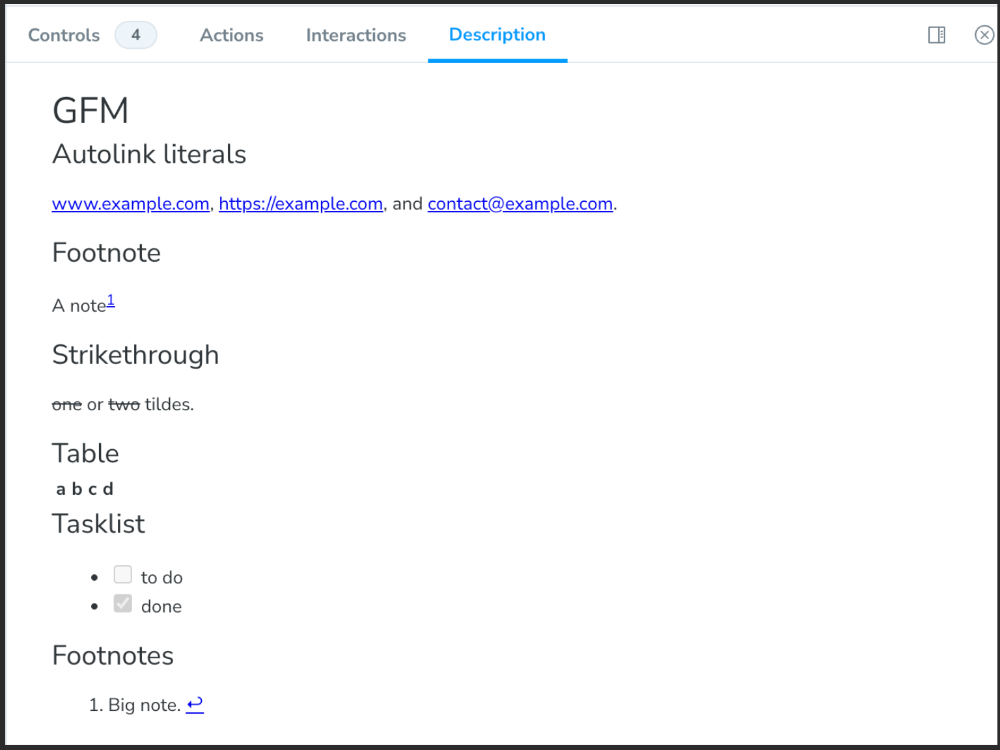

# Storybook Addon description
Add description to panel



## Installation

First, install the package.

```sh
npm install --save-dev storybook-addon-description
```

Then, register it as an addon in `.storybook/main.js`.

```js
// .storybook/main.ts

// Replace your-framework with the framework you are using (e.g., react-webpack5, vue3-vite)
import type { StorybookConfig } from '@storybook/your-framework';

const config: StorybookConfig = {
  // ...rest of config
  addons: [
    '@storybook/addon-essentials',
    'storybook-addon-description', // 👈 register the addon here
  ],
};

export default config;
```

## Usage

The primary way to use this addon is to define the `description` parameter. You can do this the
single story, as below.

```js
// Button.stories.ts

// Replace your-framework with the name of your framework
import type { Meta } from '@storybook/your-framework';

import { Button } from './Button';

const meta: Meta<typeof Button> = {
  component: Button,
};

export default meta;

export const Primary: Story = {
  // More on args: https://storybook.js.org/docs/react/writing-stories/args
  args: {
    primary: true,
    label: "Button"
  },
  parameters: { description: `
# GFM

## Autolink literals

www.example.com, https://example.com, and contact@example.com.

## Footnote

A note[^1]

[^1]: Big note.

## Strikethrough

~one~ or ~~two~~ tildes.

## Table

| a | b  |  c |  d  |
| - | :- | -: | :-: |

## Tasklist

* [ ] to do
* [x] done
` }
};

```
